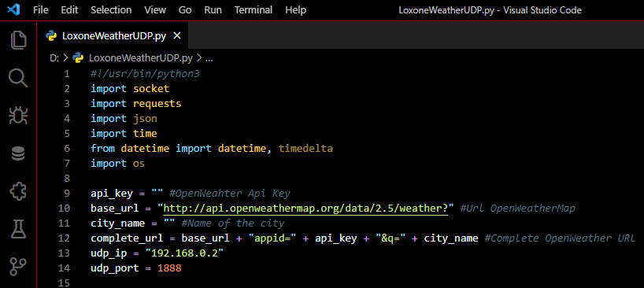

# Bloody Night
Bloody Night theme for VS Code. Great mix of black and red.

   

## Screenshot
Screenshot of a Loxone-Weather-UDP written in Python

If you like this checkout [Bloody Night](https://marketplace.visualstudio.com/items?itemName=wolfror.bloody-night)

## Changelog
You can take a look at the change log [here](https://github.com/WolfRorDev/bloody-night/blob/master/CHANGELOG.md)